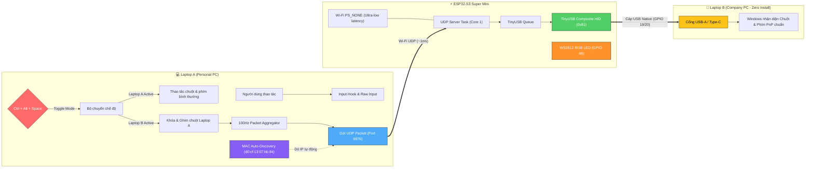

# 🖱️⌨️ KM Bridge: Hardware USB HID Keyboard & Mouse Sharing

Chia sẻ bàn phím và chuột từ **Laptop A** (cá nhân) sang **Laptop B** (máy công ty) thông qua vi điều khiển **ESP32-S3** giả lập USB HID phần cứng và truyền nhận dữ liệu qua giao thức Wi-Fi UDP tốc độ cao, độ trễ cực thấp (~1ms).

---

## 🏗️ Kiến Trúc Hệ Thống



---

## 🚦 Trạng Thái Đèn LED RGB (GPIO 48)

| Màu sắc | Hiệu ứng | Ý nghĩa |
| :--- | :--- | :--- |
| 🟡 **Vàng (Yellow)** | Nhấp nháy | Đang kết nối vào mạng Wi-Fi |
| 🔴 **Đỏ (Red)** | Sáng liên tục | Kết nối Wi-Fi thất bại (tự động thử lại) |
| 🟢 **Xanh lá (Green)** | Sáng liên tục | Đã kết nối Wi-Fi thành công, chế độ điều khiển **Laptop A** |
| 🔵 **Xanh lơ (Cyan)** | Sáng liên tục | Đang điều khiển **Laptop B** (Active Mode ON) |

---

## 📡 Bảng Mã Giao Thức (UDP Binary Protocol)

Tất cả các gói tin được định dạng nhị phân theo chuẩn Little-Endian, tối giản tối đa overhead mạng:

| OpCode | Lệnh | Payload | Kích thước | Mô tả |
| :---: | :--- | :--- | :---: | :--- |
| `0x01` | **CMD_MOUSE_MOVE** | `dx (int16)`, `dy (int16)` | 5 Bytes | Di chuyển chuột tương đối từ cảm biến phần cứng |
| `0x02` | **CMD_MOUSE_CLICK** | `button (uint8)`, `pressed (uint8)` | 3 Bytes | Nhấn/nhả nút chuột (1=Trái, 2=Phải, 4=Giữa) |
| `0x03` | **CMD_MOUSE_SCROLL** | `delta (int16)` | 3 Bytes | Cuộn bánh xe chuột (Vertical wheel) |
| `0x04` | **CMD_KEY_PRESS** | `keycode (uint8)`, `modifiers (uint8)` | 3 Bytes | Nhấn phím kèm mã Modifier bitmask |
| `0x05` | **CMD_KEY_RELEASE** | `keycode (uint8)` | 2 Bytes | Nhả phím đơn lẻ |
| `0xFE` | **CMD_ACTIVE** | *(không có)* | 1 Byte | Kích hoạt điều khiển Laptop B, LED hóa Cyan |
| `0xFF` | **CMD_INACTIVE** | *(không có)* | 1 Byte | Trả quyền về Laptop A, nhả toàn bộ phím/chuột |
| `0xAA` | **CMD_REBOOT_BOOTLOADER** | *(không có)* | 1 Byte | Yêu cầu ESP32 khởi động lại vào ROM Download Mode |

---

## 🚀 Hướng Dẫn Sử Dụng

> [!NOTE]
> Mạch **ESP32-S3** cắm vào **Laptop B**. Laptop B tự nhận là chuột và bàn phím phần cứng tiêu chuẩn Logitech/Generic, **hoàn toàn zero footprint, không cài bất kỳ phần mềm nào trên máy B**.

### 1. Khởi động Client trên Laptop A

Chạy trực tiếp file batch tiện ích:
```cmd
run_client.bat
```
Hoặc chạy lệnh Python:
```bash
python -m desktop.main
```

> [!TIP]
> **Tính năng Tự Động Tìm Kiếm (Auto-Discovery):**
> Client tích hợp cơ chế tự động quét bảng ARP tìm địa chỉ MAC phần cứng của ESP32 (`d0:cf:13:07:bb:84`). Dù router Wi-Fi có đổi IP DHCP mỗi ngày, client vẫn tự động bắt đúng IP và kết nối tức thì mà bạn không cần sửa file config!

### 2. Phím tắt chuyển đổi (Toggle Hotkey)

- Bấm tổ hợp phím **`Ctrl + Alt + Space`**:
  - Chuyển sang điều khiển **Laptop B** (Đèn LED ESP32 chuyển sang màu Cyan 🔵, chuột và bàn phím Laptop A bị khóa và chuyển hướng sang Laptop B).
  - Bấm lại **`Ctrl + Alt + Space`** để trả quyền điều khiển về **Laptop A** (Đèn LED ESP32 chuyển về màu Xanh lá 🟢).

### 3. Nạp Firmware hoặc Cập Nhật từ xa (OTA Bootloader)

> [!IMPORTANT]
> Khi cổng USB của ESP32 đã chuyển sang chuẩn USB HID, bạn **không cần bấm nút vật lý BOOT/RST** trên mạch để nạp lại firmware.
> Chỉ cần click đúp:
> ```cmd
> flash_firmware.bat
> ```
> Script sẽ tự động:
> 1. Gửi gói tin UDP `0xAA` qua Wi-Fi để đưa ESP32 vào **ROM Download Mode** (COM4).
> 2. Tự dọn sạch thư mục build cũ và biên dịch firmware mới bằng ESP-IDF.
> 3. Nạp firmware trực tiếp vào mạch 100% tự động.

---

## 📁 Cấu Trúc Mã Nguồn

```
keyboard-mouse-control/
├── desktop/                      # Ứng dụng điều khiển trên Laptop A (Python)
│   ├── config.py                 # Cấu hình IP ESP32, Port, Hotkey, độ nhạy chuột
│   ├── controller.py             # Bộ điều phối Hook chuột/phím, ghim trỏ và worker 100Hz
│   ├── hid_keycodes.py           # Bảng ánh xạ mã phím Windows Virtual-Key -> USB HID Usage ID
│   ├── network.py                # UDP Socket client tốc độ cao + MAC Auto-Discovery
│   ├── protocol.py               # Đóng gói binary struct (khớp với firmware)
│   ├── raw_mouse.py              # Đọc xung chuột phần cứng qua Windows Raw Input API
│   └── main.py                   # Điểm khởi chạy CLI
├── firmware/                     # ESP-IDF v6.0.2 Firmware cho ESP32-S3
│   ├── main/
│   │   ├── protocol.h            # Định nghĩa các struct packet binary
│   │   ├── wifi_config.h         # SSID, Password, Port, GPIO config
│   │   ├── usb_hid.c / .h        # Driver TinyUSB Composite Keyboard + Mouse (Retry buffer)
│   │   ├── wifi_udp.c / .h       # Driver Wi-Fi Station (PS_NONE) + UDP Server Task
│   │   ├── rgb_led.c / .h        # Driver RMT điều khiển WS2812 RGB LED (GPIO 48)
│   │   └── main.c                # FreeRTOS app_main khởi tạo các module
│   └── CMakeLists.txt            # Cấu hình build ESP-IDF độc lập
├── docs/                         # Tài liệu kỹ thuật chi tiết
│   ├── PROJECT_PLAN.md           # Kế hoạch và kiến trúc tổng quan
│   └── WORKFLOW.md               # Quy trình triển khai và kiểm thử từng phase
├── flash_firmware.bat            # Script nạp firmware tự động một click
├── flash_firmware.ps1            # Logic build và flash tự động (ESP-IDF v6)
├── run_client.bat                # Shortcut khởi động client trên Laptop A
├── reboot_esp32_bootloader.bat   # Shortcut kích hoạt bootloader từ xa qua Wi-Fi
└── README.md                     # Tài liệu hướng dẫn sử dụng chính
```
