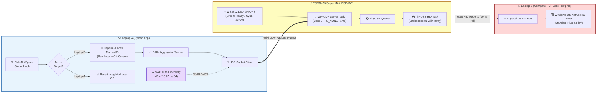
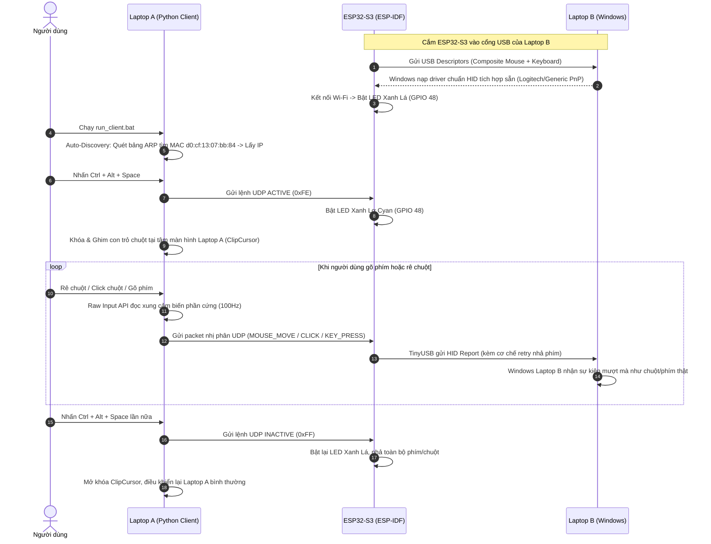

# 🖱️⌨️ Keyboard + Mouse Control — Project Plan

## Mục Đích Dự Án

Chia sẻ bàn phím và chuột của **Laptop A** (cá nhân) để điều khiển **Laptop B** (công ty) thông qua **ESP32-S3** làm cầu nối USB HID native (sử dụng framework **ESP-IDF v6.0.2**), mà **không cần cài/chạy bất kỳ phần mềm nào trên Laptop B**.

> [!NOTE]
> Dự án sử dụng framework chuyên nghiệp **ESP-IDF v6.0.2** thay vì Arduino core để tối ưu hóa hiệu năng, giảm độ trễ (latency), tắt Wi-Fi Power Save (`WIFI_PS_NONE` ~1ms), và kiểm soát stack USB TinyUSB trực tiếp ở tầng kernel FreeRTOS.

---

## Ràng Buộc & Phần Cứng

| Mục | Chi tiết |
| :--- | :--- |
| **Laptop A** | Windows, USB-C + USB-A, cài Python 3.14 + ESP-IDF v6.0.2 toolchain |
| **Laptop B** | Windows, chỉ USB-A, máy công ty — **Zero Install / Zero Footprint** |
| **Vi điều khiển** | ESP32-S3 Super Mini (Dual-core Xtensa LX7, USB OTG Hardware) |
| **Framework Firmware** | **ESP-IDF v6.0.2** (TinyUSB HID + FreeRTOS + lwIP UDP + RMT WS2812) |
| **Kết nối PC B** | Cáp USB-C to USB-A (cắm cổng USB OTG native GPIO 19/20) |
| **Giao thức mạng** | Cùng mạng Wi-Fi (UDP socket, tốc độ cao, độ trễ ~1ms) |
| **Cơ chế chuyển đổi** | **Hotkey toggle** `Ctrl + Alt + Space` |
| **Địa chỉ MAC ESP32** | `d0:cf:13:07:bb:84` (Hỗ trợ Auto-Discovery tự động dò IP) |

---

## Kiến Trúc Tổng Quan

---

## Cách Thức Hoạt Động

> [!IMPORTANT]
> Toàn bộ quá trình diễn ra hoàn toàn vô hình đối với IT Department của Laptop B, vì ESP32-S3 gửi tín hiệu phần cứng chuẩn USB HID (tương đương với một bộ chuột/bàn phím rời Logitech cắm qua cổng USB).

---

## Bảng Mã Giao Thức (Binary UDP Protocol)

Gói tin nhị phân định dạng gọn nhẹ (Little-Endian) để đạt tốc độ xử lý tối đa trên ESP-IDF:

| Byte Type | Tên Lệnh | Payload | Kích thước | Mô tả |
| :---: | :--- | :--- | :---: | :--- |
| `0x01` | **CMD_MOUSE_MOVE** | `dx (int16)` + `dy (int16)` | 5 Bytes | Di chuyển con trỏ chuột tương đối (Raw delta) |
| `0x02` | **CMD_MOUSE_CLICK** | `button (uint8)` + `pressed (uint8)` | 3 Bytes | Click/Nhả nút chuột (1=Trái, 2=Phải, 4=Giữa) |
| `0x03` | **CMD_MOUSE_SCROLL** | `delta (int16)` | 3 Bytes | Cuộn bánh xe chuột (Vertical wheel) |
| `0x04` | **CMD_KEY_PRESS** | `keycode (uint8)` + `modifiers (uint8)` | 3 Bytes | Nhấn phím kèm phím bổ trợ (Ctrl/Shift/Alt/GUI) |
| `0x05` | **CMD_KEY_RELEASE** | `keycode (uint8)` | 2 Bytes | Nhả phím đơn lẻ |
| `0xFE` | **CMD_ACTIVE** | *(không có)* | 1 Byte | Kích hoạt chế độ điều khiển Laptop B (LED Cyan) |
| `0xFF` | **CMD_INACTIVE** | *(không có)* | 1 Byte | Ngắt chế độ, nhả toàn bộ phím và nút chuột (LED Green) |
| `0xAA` | **CMD_REBOOT_BOOTLOADER** | *(không có)* | 1 Byte | Khởi động lại ESP32 vào ROM Download Mode |

---

## Kế Hoạch Triển Khai & Kiểm Thử

| Giai đoạn | Nội dung thực hiện | Trạng thái |
| :--- | :--- | :---: |
| **Phase 0** | Chuẩn bị môi trường ESP-IDF v6, Python client và kiểm tra chip ESP32-S3 | ✅ Đã hoàn thành |
| **Phase 1** | Xây dựng Firmware ESP-IDF (TinyUSB Composite HID, Wi-Fi Station, UDP Server, WS2812) | ✅ Đã hoàn thành |
| **Phase 2** | Xây dựng Desktop Client (Windows Raw Input API, Keyboard Hook, Network Client) | ✅ Đã hoàn thành |
| **Phase 3** | Tích hợp Hotkey Toggle `Ctrl+Alt+Space`, ClipCursor ghim trỏ và chuyển đổi mượt mà | ✅ Đã hoàn thành |
| **Phase 4** | Kiểm thử tích hợp (chống nuốt phím, chống bay chuột, tắt modem sleep Wi-Fi) | ✅ Đã hoàn thành |
| **Phase 5** | Tối ưu hóa: Auto-Discovery theo MAC, OTA reboot bootloader từ xa, build script tự động | ✅ Đã hoàn thành |
