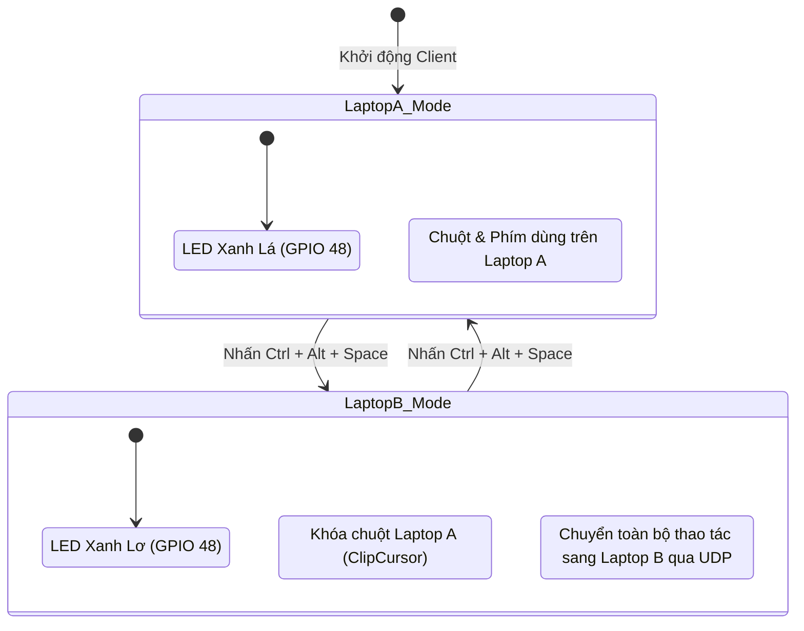

# 🔧 Workflow Triển Khai & Kiểm Thử — KM Bridge (ESP-IDF)

> [!NOTE]
> Tài liệu này ghi nhận toàn bộ quy trình triển khai thực tế của dự án **KM Bridge** bằng **ESP-IDF v6.0.2** (chạy trên ESP32-S3 Super Mini) và ứng dụng **Python** (trên Laptop A).
> Toàn bộ các vấn đề kỹ thuật phát sinh và giải pháp tối ưu hóa phần cứng đã được kiểm chứng và hoàn thiện.

---

## 🗺️ Sơ Đồ Quy Trình Các Phase

```mermaid
flowchart LR
    P0["📋 Phase 0<br/>Môi trường & ESP-IDF<br/>(Toolchain check)"] --> P1["⚡ Phase 1<br/>ESP32-S3 Firmware<br/>(TinyUSB + WiFi UDP)"]
    P1 --> P2["🖱️ Phase 2<br/>Laptop A App<br/>(Raw Input + Hook)"]
    P2 --> P3["🔀 Phase 3<br/>Hotkey Toggle<br/>(Ctrl+Alt+Space)"]
    P3 --> P4["🧪 Phase 4<br/>Fix Lag & Kẹt Phím<br/>(PS_NONE + Raw Input)"]
    P4 --> P5["✨ Phase 5<br/>Auto-Discovery & Polish<br/>(MAC ARP + Flash Tool)"]

    style P0 fill:#e2e8f0,stroke:#4a5568,stroke-width:2px
    style P1 fill:#feebc8,stroke:#dd6b20,stroke-width:2px
    style P2 fill:#bee3f8,stroke:#3182ce,stroke-width:2px
    style P3 fill:#c6f6d5,stroke:#38a169,stroke-width:2px
    style P4 fill:#fed7d7,stroke:#e53e3e,stroke-width:2px
    style P5 fill:#d3f9d8,stroke:#2b8a3e,stroke-width:2px
```

---

## Phase 0 — Môi Trường ESP-IDF & Nhận Diện Phần Cứng

- [x] **Python 3.14** trên Laptop A (Host runtime)
- [x] **ESP-IDF v6.0.2**: Cài đặt tại `D:\esp\v6.0.2\esp-idf`
- [x] **ESP Tools**: Cài đặt tại `C:\Espressif\tools` (`ninja 1.12.1`, `cmake 4.0.3`, `xtensa-esp-elf`)
- [x] **Cổng Serial ESP32**: `USB Serial Device (COM4)` trong chế độ Download Bootloader

---

## Phase 1 — Firmware ESP32-S3 (ESP-IDF v6.0.2)

### 1. Stack TinyUSB Composite Device
- **Descriptor HID**: Kết hợp đồng thời Bàn phím chuẩn 8-byte và Chuột 5-byte trên cùng Endpoint `0x81`.
- **Cơ chế chống nghẽn Endpoint**: Khi endpoint bận (`!tud_hid_ready()`), chuột tự động nhường đường và bàn phím kích hoạt vòng lặp thử lại tối đa 30ms (`send_keyboard_report_with_retry()`). Đảm bảo không bao giờ bị rớt gói nhả phím làm kẹt ký tự trên máy B.

### 2. Stack Mạng Wi-Fi & UDP Server
- Cấu hình Wi-Fi Station kết nối mạng nội bộ 2.4GHz.
- **Tắt hoàn toàn Modem Sleep**: Gọi ngay `esp_wifi_set_ps(WIFI_PS_NONE)` sau khi start Wi-Fi, hạ độ trễ ping mạng từ 100-300ms xuống chỉ còn **1-2ms**.
- **Task UDP Server**: Pin cố định vào Core 1 của ESP32 với priority `configMAX_PRIORITIES - 2` để phản hồi tức thì.

### 3. Đèn Báo Trạng Thái WS2812 (GPIO 48)
- Sử dụng driver RMT hardware điều khiển LED RGB:
  - 🟡 **Vàng nhấp nháy**: Đang kết nối Wi-Fi.
  - 🔴 **Đỏ**: Wi-Fi thất bại.
  - 🟢 **Xanh lá**: Sẵn sàng, chế độ điều khiển Laptop A.
  - 🔵 **Xanh lơ (Cyan)**: Chế độ điều khiển Laptop B (Active Mode ON).

---

## Phase 2 — Desktop Client Trên Laptop A (Python)

### 1. Bắt Phím & Chuột
- **Bàn phím**: Dùng thư viện `pynput` bắt phím toàn cục. Tách biệt hoàn toàn mã Modifier (`0xE0..0xE7` - Ctrl, Alt, Shift, Win) vào byte bitmask riêng, không nhét vào mảng keycode thường để tránh vi phạm USB HID Spec làm crash driver Windows.
- **Chuột (Raw Input API)**: Thay thế hoàn toàn cơ chế `WH_MOUSE_LL` cũ (vốn gây văng chuột và đảo chiều tọa độ) bằng **Windows Raw Input API (`WM_INPUT`)**. Đọc trực tiếp xung cảm biến chuột từ phần cứng (`lLastX`, `lLastY`), mượt mà và chính xác 1:1.
- **Khóa chuột khi Active**: Sử dụng Windows API `ClipCursor` ghim chặt con trỏ vào tâm màn hình Laptop A, chặn toàn bộ click chuột trái/phải không để rò rỉ sang Laptop A.

### 2. Bộ Gom Gói Chuột 100Hz
- Một worker thread chuyên dụng chạy vòng lặp 100Hz (10ms interval, khớp chính xác polling rate USB HID của máy B), tích lũy xung di chuyển và gửi 1 gói UDP duy nhất. Loại bỏ hoàn toàn hiện tượng nghẽn hàng đợi UDP trên Wi-Fi.

---

## Phase 3 — Chuyển Đổi Trạng Thái (Hotkey Toggle)

---

## Phase 4 — Giải Quyết Các Sự Cố Thực Tế (Bug Fixes)

| Triệu chứng lỗi ban đầu | Nguyên nhân cốt lõi | Giải pháp đã khắc phục triệt để |
| :--- | :--- | :--- |
| **Kẹt / Nuốt phím trên máy B** | Mã modifier (`0xE0..0xE7`) bị gửi vào mảng `active_keys` làm vi phạm USB HID spec; hoặc endpoint bận làm mất gói nhả phím | Tách riêng modifier bitmask; thêm `send_keyboard_report_with_retry()` thử lại tới 30ms |
| **Chuột bị văng khỏi màn hình / giật ngược** | Hook `WH_MOUSE_LL` bị lệch mốc tọa độ khi suppress cursor | Chuyển sang đọc xung phần cứng qua **Windows Raw Input API (`WM_INPUT`)** |
| **Chuột bị lag / trễ 1-2 giây** | Wi-Fi ESP-IDF mặc định bật `WIFI_PS_MIN_MODEM` gây sleep 100-300ms; gửi quá nhiều gói UDP riêng lẻ làm nghẽn | Gọi `esp_wifi_set_ps(WIFI_PS_NONE)`; thêm worker gom gói 100Hz |
| **Click chuột phải trên B bị dính trên A** | Hook chuột thiếu cờ chặn phím chuột phải và giữa | Cập nhật hàm lọc message trong `RawMouseListener` chặn đủ `WM_LBUTTONDOWN/UP`, `WM_RBUTTONDOWN/UP`, `WM_MBUTTONDOWN/UP`, `WM_MOUSEWHEEL` |
| **Build firmware báo lỗi Ninja / ccache** | Subprocess PowerShell và CMD con không nhận diện được biến `PATH` của toolchain | Khóa cứng `CMAKE_MAKE_PROGRAM`, tắt `CCACHE_ENABLE` và truyền đường dẫn compiler tuyệt đối |

---

## Phase 5 — Tối Ưu Hóa & Tự Động Hóa (Production Polish)

### 1. Cơ Chế Auto-Discovery Bằng Địa Chỉ MAC
- **Vấn đề**: Router Wi-Fi thường xuyên cấp IP DHCP mới mỗi ngày, khiến client gửi nhầm vào IP cũ.
- **Giải pháp**: Client tích hợp hàm `discover_esp32_ip()` trong [`desktop/network.py`](file:///D:/WorkSpace/keyboard-mouse-control/desktop/network.py). Khi khởi động, client tự quét bảng ARP tìm địa chỉ MAC phần cứng của chip (`d0:cf:13:07:bb:84`) và cập nhật IP tự động.

### 2. Nạp Firmware Không Cần Bấm Nút (OTA Reboot Bootloader)
- **Vấn đề**: Cổng USB của ESP32 sau khi nạp firmware đã trở thành thiết bị HID, cổng COM biến mất.
- **Giải pháp**: Gửi gói tin nhị phân `0xAA` qua Wi-Fi UDP. Firmware nhận lệnh sẽ ghi cờ `RTC_CNTL_FORCE_DOWNLOAD_BOOT` vào thanh ghi RTC và restart chip ngay vào **ROM Download Mode** (`COM4`). Script [`flash_firmware.bat`](file:///D:/WorkSpace/keyboard-mouse-control/flash_firmware.bat) tự động hóa hoàn toàn quy trình này chỉ với một cú click chuột.
